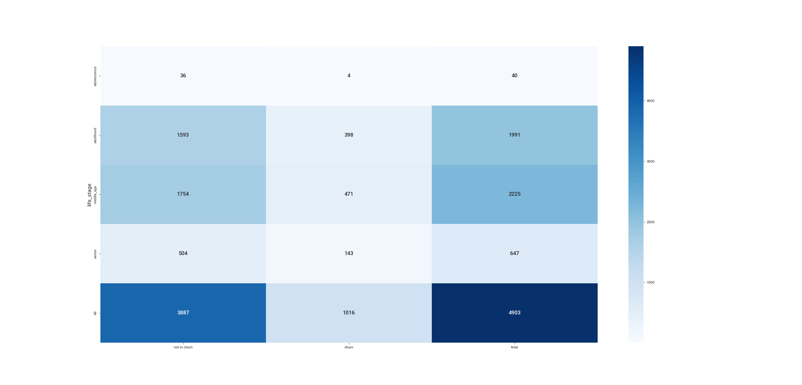

# <b>Client Churn Prediction</b>

## Summary
- [1. Business Problem](#1-business-problem)
- [2. Dataset](#2-dataset)
- [3. Solution Strategy](#3-solution-strategy)
- [4. Mind Map Hypothesis](#4-mind-map-hypothesis)
- [5. Top 3 Data Insights](#5-top-3-data-insights)
- [6. Machine Learning Model Applied](#6-machine-learning-model-applied)
- [7. Optimization Process](#7-optimization-process)
- [8. Business Performance](#8-business-performance)
- [9. Streamlit Churn Prediction App](#9-streamlit-churn-prediction-app)
- [10. Lessons Learned](#10-lessons-learned)
- [11. Next Steps](#11-next-steps)

---
## 1. Business Problem

> Disclaimer: This is a fictional bussiness case

The Top Bank company operates in Europe with a bank account as the main product, this product can keep client's salary and make payments. This account doesn't have any cost in the first 12 months, however, after that time trial, the client needs to rehire the bank for upcoming 12 months and redo this process every year. Recently the Analytics Team noticed that the churn rate is increasing.

### 1.1 Challenge
As a Data Scientist, you need to create an action plan to decrease the number of churn customers and show the financial return on your solution.
In addition, you will need to provide a report reporting your model's performance and the financial impact of your solution. 
Questions that the CEO and the Analytics team would like to see in their report:

1.  What is Top Bank's current Churn rate?
2.  How does the churn rate vary monthly?
3.  What is the performance of the model in classifying customers as churns?
4.  What is the expected return, in terms of revenue, if the company uses its model to avoid churn from customers?

---
## 2. Dataset
The dataset is available on: https://www.kaggle.com/mervetorkan/churndataset


**Data fields**

- **RowNumber**: the number of the columns
- **CustomerID**: unique identifier of clients
- **Surname**: client's last name
- **CreditScore**: clien'ts credit score for the financial market
- **Geography**: the country of the client
- **Gender**: the gender of the client
- **Age**: the client's age
- **Tenure**: number of years the client is in the bank 
- **Balance**: the amount that the client has in their account 
- **NumOfProducts**: the number of products that the client bought 
- **HasCrCard**: if the client has a credit card 
- **IsActiveMember**: if the client is active (within the last 12 months) 
- **EstimateSalary**: estimative of anual salary of clients 
- **Exited**: if the client is a churn (*target variable*)
---
## 3. Solution Strategy
To Answers the Analytics Team and CEO questions, An exploratory data analysis will be performed, after that, a machine learning model will be developed following the strategy to answer this:

1. Which customer will be in churn:
    - What is the criterion?
        - Downtime
        - Time remaining until the contract ends

2. Current churn rate of the company:
    - Calculate churn rate
    - Calculate monthly churn rate and variation

3. Performance of the model:
    - Precision
    - Recall
    - F1 Score

4. Action plan:
    - Discount?
    - Voucher?
    - Deposit bonus?

#### 3.1 Steps

**Step 01. Data Description:**  Use descriptive statistics metrics to measure data distribution

**Step 02. Feature Engineering:** Create features to describe the fenomenous.

**Step 03. Data Filtering:**  Filter the features values to make ML modelling easier.

**Step 04. Exploratory Data Analysis:** Find insights to better describe the fenomenous and brake wrong concepts.

**Step 05. Data Preparation:**  Select the most important features and prepare the data to the step 6.

**Step 06. Machine Learning Modelling:** Machine Learning model selection and training.

**Step 07. Hyperparameter Fine Tunning:** Find the best values of each parameter of the model.

**Step 08. Final Model:** Select the best parameters and prove that it brings good results.

**Step 09. Business Translation:** Convert the machine learning performance into business result.

---

## 4. Mind Map Hypothesis

<p align='center'>
    

## 5. Top 3 Data Insights

**Insight 01:** Clients with more products has more tendency to be churn.


**Insight 02:** In proportion, clients with 60 years and above has more tendency to be in churn than adolescents and adults.

 
 
**Insight 03:** Seniors has a higher churn tendency than others.
    
| Life stage  | Churn % |
| ----------- | ------- |
| Adolescence | 5.618   |
| Adulthood   | 8.189   |
| Middle Age  | 23.827  |
| Senior      | 43.710  |

 

---

## 6. Machine Learning Model Applied

The tested models are:


- Logistic Regression
- KNeighbors Classifier
- Decision Tree Classifier
- Random Forest Classifier
- Extra Trees Classifier
- AdaBoost Classifer
- XGBoost Classifier
- CatBoost Classifier
- Gradient Boosting Classifier
- LGBM Classifier

As a classification problem with imbalanced data, [the accuracy of the model alone doesn't tell us much](https://medium.com/data-hackers/indo-além-da-acurácia-entendo-a-acurácia-balanceada-precisão-recall-e-f1-score-c895e55a9753), for a better analysis, we use other metrics such as precision, recall and F1-Score.

Using the Cross Validation with 5 parts, The mean recall result of the CatBoost Classifier and LGBM Classifier.

## 7. Optimization Process

### Bayesian Search Fine-Tuning with Optuna

We employed Bayesian search optimization using Optuna to fine-tune hyperparameters and improve the overall performance of the churn prediction model. Optuna's efficient search algorithm helped us explore the hyperparameter space effectively, leading to improved model performance.

### Threshold Adjustment for Recall Optimization

To further enhance the recall, we adjusted the decision threshold of the model. By carefully selecting a higher threshold, we prioritized capturing more true positives, even at the expense of precision. This adjustment resulted in a significant improvement in recall, reaching the desired level of 0.68.

## Key Steps

1. **Optuna Bayesian Search:**
   - Utilized Optuna for efficient hyperparameter optimization.
   - Explored the hyperparameter space to identify optimal values for improved model performance.

2. **Threshold Adjustment:**
   - Experimented with different decision thresholds for model predictions.
   - Selected a higher threshold to increase recall, focusing on capturing more true positives.
  
   

## Results

The combined efforts of Bayesian search fine-tuning and threshold adjustment led to a substantial improvement in the recall metric. The model now successfully identifies a higher proportion of actual churn cases, enhancing its practical utility in customer retention efforts.

The performance of the tunned model was much higher than the basic CatBoost, you can see that in the confusion matrix where the basic model is on the left and the tunned on the other side. Despite the low gain in accuracy and precision, the tuned model has better results, and you need to remember that we are dealing with a very imbalanced dataset.

| CatBoostClassifier | Accuracy | Precision | Recall | F1-Score | ROCAUC |
| ------------------ | -------- | --------- | ------ | -------- | ------ |
| Basic              | 69.5%    | 65.2%     | 46.7%  | 50.2%    | 69.5%  |
| Tunned             | 76.5%    | 55.5%     | 67.5%  | 60.3%    | 76.5%  |

---

## 8. Business Performance

### 1.  What is Top Bank's current Churn rate?
**The current churn rate is 20.37%**

### 2.  How does the churn rate vary monthly?
**The monthly churn rate varies, on average, 8.33%**

### 3.  What is the performance of the model in classifying customers as churns?

| Model              | Accuracy | Precision | Recall | F1-Score | ROCAUC |
| ------------------ | -------- | --------- | ------ | -------- | ------ |
| CatBoostClassifier | 76.1%    | 53.6%     | 67.1%  | 59.6%    | 76.1%  |


### 4.  What is the expected return, in terms of revenue, if the company uses its model to avoid churn from customers?

- The bank is **losing *$7,517,032.21* in this dataframe because of the churn**
- The return of all clients in this dataframe are: *$38,210,856.42*
- Using the knapsack approach with an incentive list with coupons of $200, $100 and $50 depending of the probability to client's churn can give:
  - Recovered Revenue: *$2733157.31*
  - Churn Loss Recovered: **100%**
  - Investment: *$10000*
  - Profit: *$2,723,157.31*
  - ROI: **21,913.87%**
  - Potential clients recovered with the model: 87 clients
 
## 9. Streamlit Churn Prediction App

### Overview

This application combines the power of the knapsack problem and a machine learning model to create simulations that showcase churn reduction, return on investment (ROI), and the impact on the number of clients returned.

### Features

- **Knapsack Problem Simulation:** Utilize the knapsack problem to optimize resource allocation, reflecting real-world scenarios where limited resources must be strategically allocated.
  
- **Machine Learning Model Integration:** The app seamlessly integrates a machine learning model designed to predict and reduce churn, allowing users to explore the potential impact of predictive analytics on customer retention.

- **ROI Visualization:** Understand the return on investment by visualizing the financial gains achieved through the simulation. Analyze how strategic decisions impact the bottom line.

- **Client Retention Analysis:** Explore and analyze the simulated scenarios to observe how different strategies influence the number of clients who return, providing valuable insights for customer relationship management.

### Getting Started

1. **Clone the Repository:**
   ```bash
   git clone https://github.com/your-username/knapsack-simulation-app.git
   ```

2. **Install Dependencies:**
   ```bash
   pip install -r requirements.txt
   ```

3. **Run the App:**
   ```bash
   streamlit run app.py
   ```

   Access the app in your browser at [https://topbank.streamlit.app/](https://topbank.streamlit.app/).

### Usage

1. **Configure Simulation Parameters:**
   - Set parameters for the knapsack problem, such as item weights and values.
   - Input data for the machine learning model, including customer features and historical data.

2. **Run the Simulation:**
   - Click the "Run Simulation" button to initiate the simulation process.

3. **Explore Results:**
   - View visualizations that illustrate the impact on churn reduction, ROI, and the number of clients returned.
   - Analyze different scenarios by adjusting parameters and observing how the outcomes change.

---

## 10. Lessons Learned

- Sometimes, new features may not help to improve performance.
- Artificially balanced models may have a lower performance on the test set.
- Accuracy alone may not be enough.
- The Lift and Cumulative Gains Curve are metrics to compare models' performance and can be used to prioritize clients to be contacted.
- The Knapsach-problem 0-1 can be applied in other context, such this churn prediction.

## 11. Next Steps

- Test other simulation with other budgets in order to search better scenarios.
- Train other models in search to better results in precision, recall and F1-Score.
- If can get more data, experiment data balance for a better performance.
